# Bloom Architecture

Comprehensive technical architecture documentation for the Bloom Budget Tracker.

## Table of Contents

1. [System Overview](#system-overview)
2. [Data Model](#data-model)
3. [Period System](#period-system)
4. [Balance Calculations](#balance-calculations)
5. [Authentication Flow](#authentication-flow)
6. [Frontend State Management](#frontend-state-management)
7. [API Communication](#api-communication)

---

## System Overview

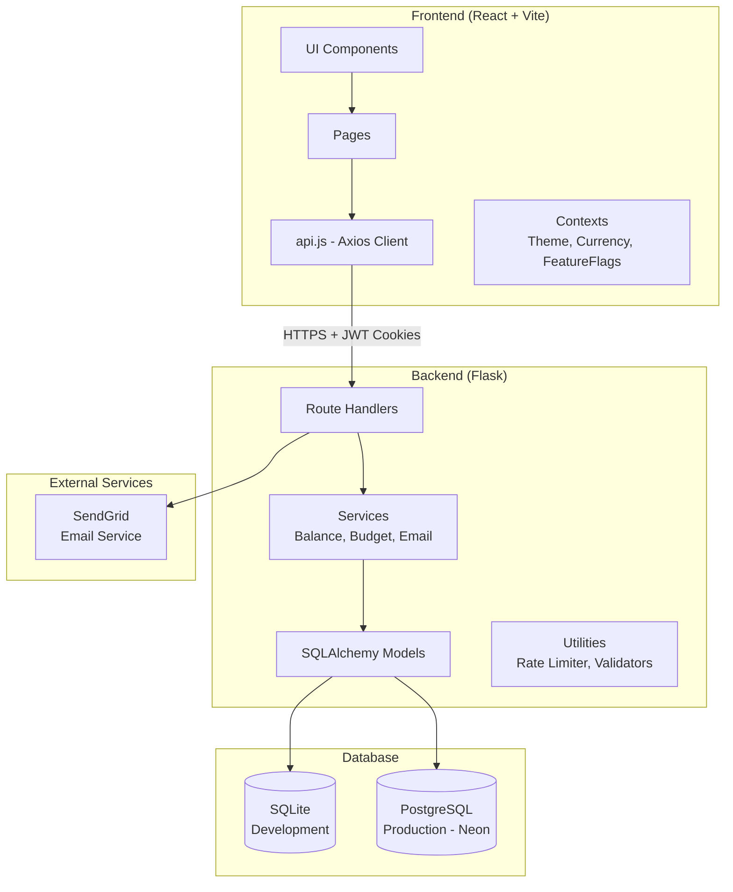

### Technology Stack

| Layer        | Technology                               |
| ------------ | ---------------------------------------- |
| **Frontend** | React 18 + Vite, Tailwind CSS            |
| **Backend**  | Flask (Python 3.11), Flask-JWT-Extended  |
| **Database** | SQLite (dev), PostgreSQL via Neon (prod) |
| **Auth**     | JWT in HttpOnly cookies                  |
| **Email**    | SendGrid                                 |
| **Hosting**  | Cloudflare Pages (FE) + Render (BE)      |

---

## Data Model

### Entity Relationship Diagram

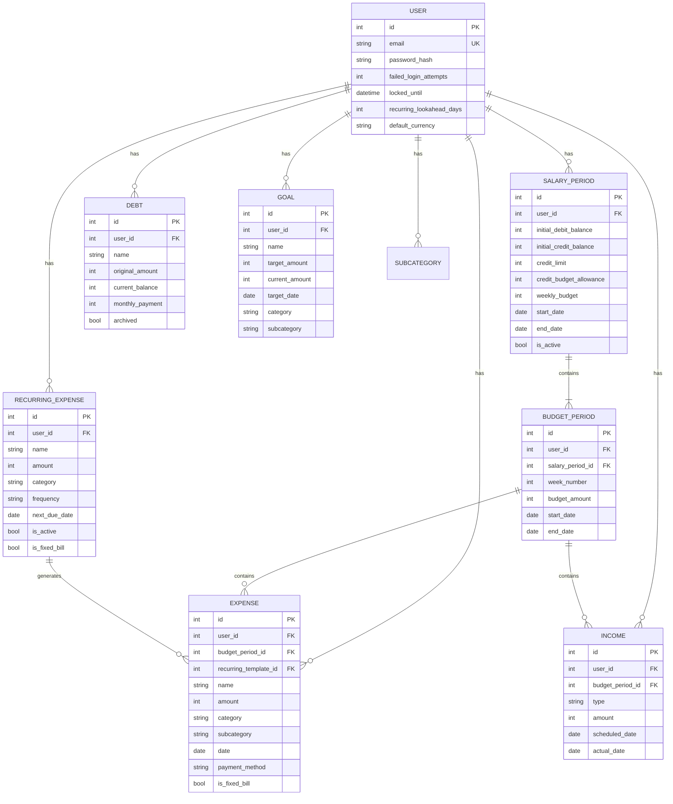

### Money Convention

**All amounts stored as integer cents** (not floats):

```
Database: 1500 = €15.00
Frontend: formatCurrency(1500) → "€15.00"
API: Always cents, never euros
```

This prevents floating-point precision errors common with currency.

---

## Period System

### Two-Tier Period Hierarchy

The core budgeting concept: a **SalaryPeriod** (4 weeks) auto-creates **BudgetPeriods** (individual weeks).

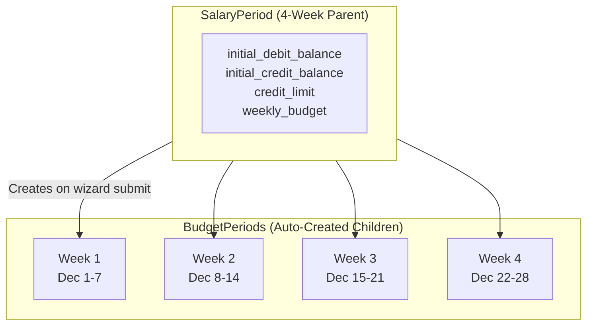

### Period Creation Flow

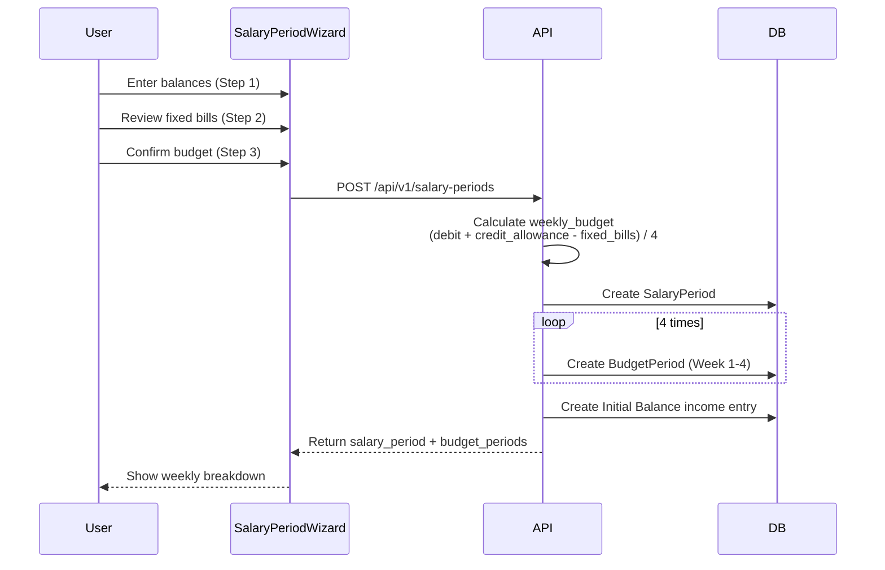

### Carryover Logic

Underspending or overspending in one week affects the next week's available budget.

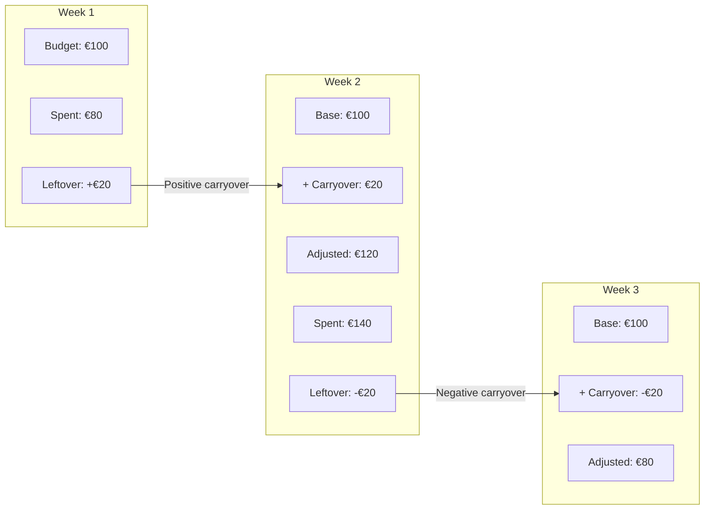

**Calculation Formula:**

```python
# From backend/services/budget_service.py
adjusted_budget = base_budget + carryover
remaining = adjusted_budget - spent
next_week_carryover = cumulative_carryover + remaining
```

### Expense → Period Assignment

Expenses are assigned to BudgetPeriods based on their date:

```javascript
// Frontend: Match expense date to period boundaries
const matchingPeriod = allPeriods.find((period) => {
    const expenseDate = new Date(expenseData.date);
    return (
        expenseDate >= new Date(period.start_date) &&
        expenseDate <= new Date(period.end_date)
    );
});
```

**Critical Rule:** Never create BudgetPeriods manually. Always let SalaryPeriod creation handle it.

---

## Balance Calculations

### Balance Types

| Balance Type         | Description                              | Stored Where         |
| -------------------- | ---------------------------------------- | -------------------- |
| **Debit Balance**    | Money available in debit account         | Calculated real-time |
| **Credit Available** | Credit card spending room (limit - debt) | Calculated real-time |
| **Credit Limit**     | Maximum credit card capacity             | SalaryPeriod         |

### Real-Time Balance Calculation

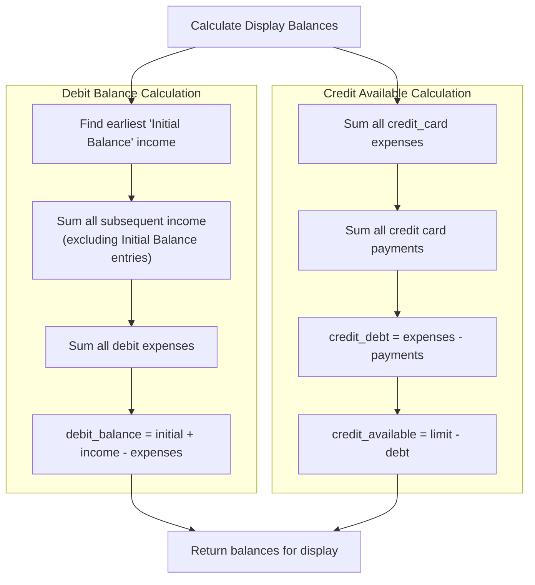

### Why Real-Time Calculation?

**Problem:** SalaryPeriods store snapshot balances at creation time. If a user creates next month's period before the current month ends, the snapshot won't include transactions made after creation.

**Solution:** `balance_service.py` always calculates from transaction source of truth:

```python
# backend/services/balance_service.py
def get_display_balances(salary_period_id, user_id):
    """
    Calculate real-time balances instead of using stored snapshots.
    Periods are cosmetic filters - balance reflects actual account state.
    """
    debit_balance = _calculate_debit_balance(user_id)
    credit_available = _calculate_credit_available(user_id, credit_limit_cents)
    return {"debit_balance": debit_balance, "credit_available": credit_available}
```

---

## Authentication Flow

### JWT in HttpOnly Cookies

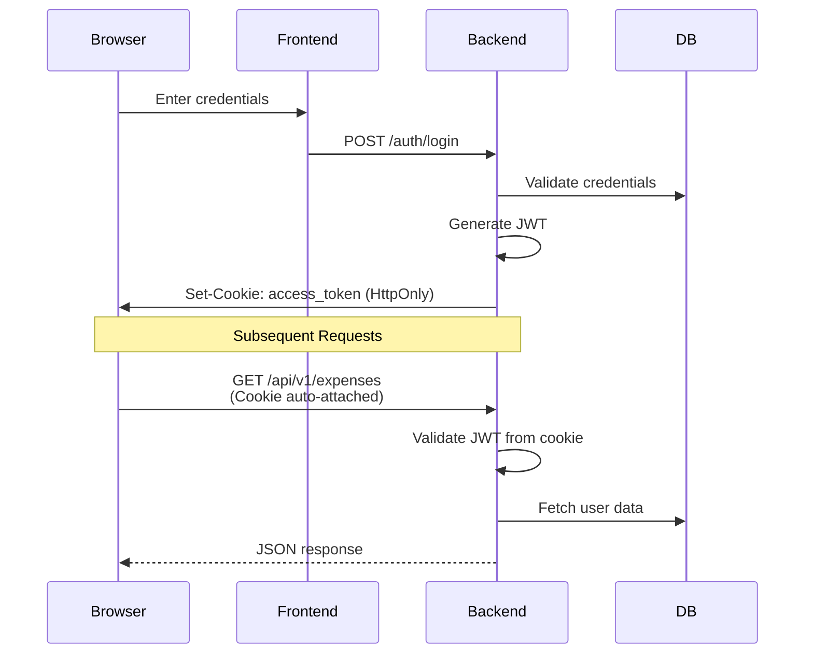

### Security Features

| Feature              | Implementation                  |
| -------------------- | ------------------------------- |
| **Token Storage**    | HttpOnly cookie (XSS-safe)      |
| **Token Expiry**     | 24 hours (supports PWA offline) |
| **Account Lockout**  | Lock after 5 failed attempts    |
| **Rate Limiting**    | In-memory, per-endpoint limits  |
| **Password Hashing** | Werkzeug (PBKDF2+SHA256)        |
| **CORS**             | Whitelist-only origins          |

### Account Lockout Flow

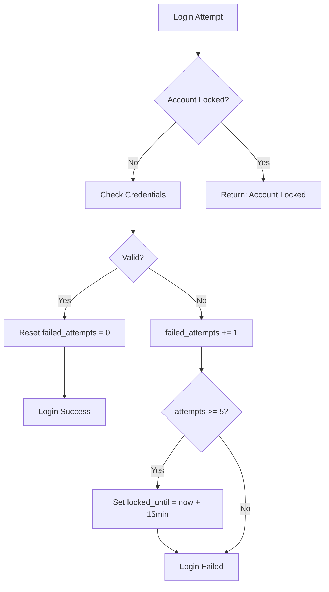

---

## Frontend State Management

### Dashboard Component Hierarchy

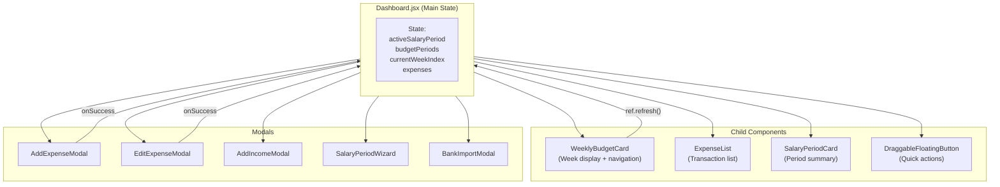

### Component Refresh Pattern

Components expose a `refresh()` method via `forwardRef` + `useImperativeHandle`:

```jsx
// WeeklyBudgetCard.jsx
const WeeklyBudgetCard = forwardRef((props, ref) => {
    useImperativeHandle(ref, () => ({
        refresh: loadWeeklyData,
    }));
});

// Dashboard.jsx - Parent triggers refresh
weeklyBudgetCardRef.current?.refresh();
```

### Context Providers

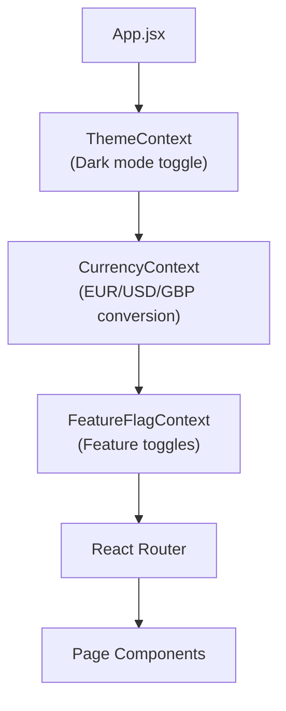

---

## API Communication

### API Structure

All endpoints are prefixed with `/api/v1/`:

```
/api/v1/
├── auth/
│   ├── login
│   ├── logout
│   ├── register
│   └── refresh
├── salary-periods/
├── budget-periods/
├── expenses/
├── income/
├── debts/
├── recurring-expenses/
├── goals/
├── subcategories/
└── export/
```

### Request Flow

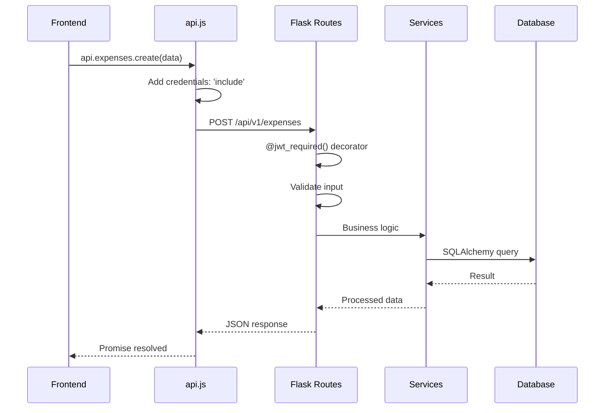

### Error Handling

```javascript
// frontend/src/api.js
const api = axios.create({
    baseURL: import.meta.env.VITE_API_URL || "http://localhost:5000",
    withCredentials: true, // Send cookies
});

// Global error handling
api.interceptors.response.use(
    (response) => response,
    (error) => {
        if (error.response?.status === 401) {
            window.location.href = "/login";
        }
        return Promise.reject(error);
    }
);
```

---

## Deployment Architecture

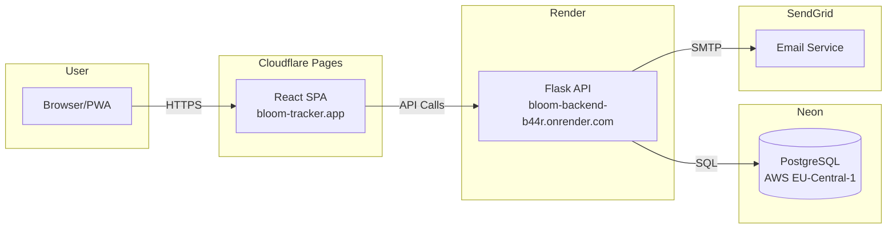

### Environment Variables

**Backend (Render):**

```bash
FLASK_ENV=production
SECRET_KEY=<64-char-random>
JWT_SECRET_KEY=<64-char-random>
DATABASE_URL=<neon-connection-string>
CORS_ORIGINS=https://bloom-tracker.app
SENDGRID_API_KEY=<optional>
```

**Frontend (Cloudflare):**

```bash
VITE_API_URL=https://bloom-backend-b44r.onrender.com
```

---

## Key Files Reference

| File                                             | Purpose                                        |
| ------------------------------------------------ | ---------------------------------------------- |
| `backend/app.py`                                 | Flask app factory, CORS, JWT config            |
| `backend/models/database.py`                     | All SQLAlchemy models                          |
| `backend/services/balance_service.py`            | Real-time balance calculations                 |
| `backend/services/budget_service.py`             | Budget math, carryover logic                   |
| `backend/routes/salary_periods.py`               | Period CRUD, weekly breakdown                  |
| `frontend/src/api.js`                            | Axios instance, API wrappers                   |
| `frontend/src/pages/Dashboard.jsx`               | Main state management, component orchestration |
| `frontend/src/components/SalaryPeriodWizard.jsx` | 3-step budget setup flow                       |
| `frontend/src/components/WeeklyBudgetCard.jsx`   | Week display with carryover                    |

---

## Common Pitfalls

| ❌ Don't                                 | ✅ Do                                        |
| ---------------------------------------- | -------------------------------------------- |
| Create BudgetPeriods manually            | Let SalaryPeriod creation handle it          |
| Create overlapping SalaryPeriods         | Delete existing period first                 |
| Edit BudgetPeriods directly              | Edit parent SalaryPeriod                     |
| Use `new Date()` for leftover allocation | Use the week's `end_date`                    |
| Store money as floats                    | Use integer cents everywhere                 |
| Read balance from SalaryPeriod snapshot  | Use `balance_service.get_display_balances()` |
